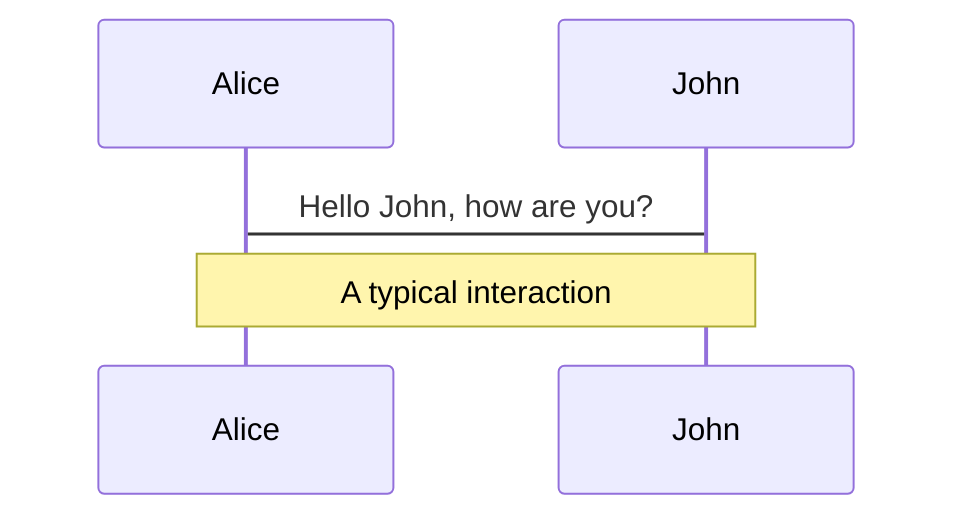
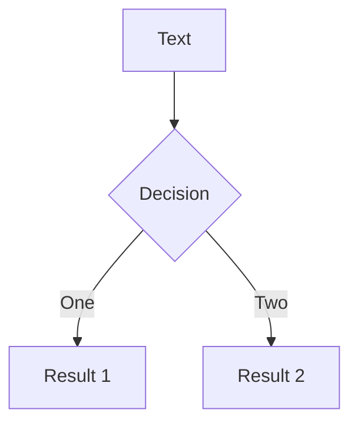

<div class="transform top-1/2 -translate-y-1/2 absolute">
  
  <h1 class="pt-8 !text-white">Titulo de<br>presentación</h1>
  <p class="pb-12 text-gray-600">subtitulo de presentación</p>
  
</div>


<!--
The last comment block of each slide will be treated as slide notes. It will be visible and editable in Presenter Mode along with the slide. [Read more in the docs](https://sli.dev/guide/syntax.html#notes)
-->

---


### Epígrafe

# Tareas diárias

## subtítulo

<p w="3/4">
Durante el proceso diario de planificación y programación es necesario contar con información, que actualmente se encuentra distribuida y clasificada de manera arbitraria.
</p>

- Resumen diario de novedades
- Ordenes de trabajo, Historial, Preventivos
- Planos, Flowsheet, Instrucciones internas
- Repuestos, Solicitudes de compra
- PQ de trabajos, Fotos, Manuales
- Puenteos, MI, MIT, Equipos indisponibles, etc...

<arrow v-click x1="355" y1="295" x2="718" y2="230" color="#ff595e" width="2.5" arrowSize="1" />
<arrow v-after x1="420" y1="330" x2="718" y2="290" color="#ff595e" width="2.5" arrowSize="1" />
<arrow v-after x1="420" y1="360" x2="718" y2="350" color="#ff595e" width="2.5" arrowSize="1" />
<arrow v-after x1="365" y1="395" x2="718" y2="415" color="#ff595e" width="2.5" arrowSize="1" />
<arrow v-after x1="350" y1="425" x2="718" y2="480" color="#ff595e" width="2.5" arrowSize="1" />

<div v-after class="right-24 bottom-4 w-max-38 absolute">
  <div class="flex items-center">
    
    <p class="text-sm ml-2">INTRANET operaciones</p>
  </div>
  <div class="flex items-center">
    
    <p class="text-sm ml-2">IFS</p>
  </div>
  <div class="flex items-center">
    
    <p class="text-sm ml-2">Ingenieria Documentación</p>
  </div>
  <div class="flex items-center">
    
    <p class="text-sm ml-2">SAP</p>
  </div>
  <div class="flex items-center">
    
    <p class="text-sm ml-2">Carpeta compartida</p>
  </div>
</div>


---


### Epígrafe

# ¿Qué es un CMMS?

## subtítulo

CMMS, abreviatura en inglés de sistema computarizado de gestión de mantenimiento, es un software que ayuda a gestionar activos, programar mantenimiento y realizar seguimiento de las órdenes de trabajo.

Es un software que **centraliza** la información de mantenimiento y facilita los procesos de las operaciones de mantenimiento.

<br>
<br>

[IBM - ¿Qué es un CMMS?](https://www.ibm.com/ar-es/topics/what-is-a-cmms)


---
preload: false
---


### Epígrafe

# Propuesta

## subtítulo

Aplicación web

<div
  v-if="$slidev.nav.clicks >= 0"
  class="top-78 left-50 absolute"
  v-motion
  :initial="{ x: 0 }"
  :enter="{ x: -80, transition: { delay: 1000, duration: 1000}}">
  <flat-color-icons-manager class="text-5xl" />
  <flat-color-icons-reading-ebook class="text-5xl" />
  <flat-color-icons-reading class="text-5xl" />
</div>

<arrow x1="400" y1="310" x2="680" y2="200" color="#ff595e" width="2.5" arrowSize="1" />
<arrow x1="400" y1="325" x2="680" y2="270" color="#ff595e" width="2.5" arrowSize="1" />
<arrow x1="400" y1="340" x2="680" y2="330" color="#ff595e" width="2.5" arrowSize="1" />
<arrow x1="400" y1="355" x2="680" y2="395" color="#ff595e" width="2.5" arrowSize="1" />
<arrow x1="400" y1="370" x2="680" y2="460" color="#ff595e" width="2.5" arrowSize="1" />

= 0"
  src="/webapp.png"
  class="top-75 left-85 w-24 absolute"
  v-motion
  :initial="{ y: -20, opacity: 0 }"
  :enter="{ y: 0, opacity: 1, transition: { delay: 1000, duration: 1000}}">

<div class="right-34 bottom-8 w-max-38 absolute">
  <div class="flex items-center">
    
    <p class="text-sm ml-2">INTRANET operaciones</p>
  </div>
  <div class="flex items-center">
    
    <p class="text-sm ml-2">IFS</p>
  </div>
  <div class="flex items-center">
    
    <p class="text-sm ml-2">Ingenieria Documentación</p>
  </div>
  <div class="flex items-center">
    
    <p class="text-sm ml-2">SAP</p>
  </div>
  <div class="flex items-center">
    
    <p class="text-sm ml-2">Carpeta compartida</p>
  </div>
</div>


---
preload: false
clicks: 10
---


### Epígrafe

# Detalles

## subtítulo

<div class="flex w-full justify-center">
  <div
    class="flex flex-col border-2 p-4 items-center"
    v-if="$slidev.nav.clicks >= 6"
    v-motion
    :initial="{ opacity: 0 }"
    :enter="{ opacity: 1, transition: { duration: 500}}"
  >
    <div class="pb-2">webapp backend</div>
    <carbon:bare-metal-server-02 class="text-4xl" />
  </div>
  <div v-if="$slidev.nav.clicks >= 4" class="flex flex-col py-4 self-end">
    <div class="flex flex-col self-start">
      <carbon:bare-metal-server-02 class="text-4xl text-indigo-400" />
      <div class="h-18 relative">
        <div
          class="flex flex-col inset-0 text-indigo-200 items-center absolute"
        >
          <carbon:arrow-down
            v-motion
            class="w-12"
            :initial="{ opacity: 0, y: 0 }"
            :enter="{ opacity: 1, y: 50, transition: { duration: 500, repeat: 2, repeatDelay: 4000, repeatType: 'loop' }}" />
          <carbon:arrow-up
            v-motion
            :initial="{ opacity: 0, y: 0 }"
            :enter="{ opacity: 1, y: -20, transition: { duration: 500, repeat: 2, repeatDelay: 4000, repeatType: 'loop' }}" />
        </div>
      </div>
    </div>
    <div class="flex items-center">
      <carbon:data-base class="text-4xl text-indigo-400" />
      <div class="flex pr-6 text-indigo-200 w-12 items-center">
        <carbon:arrow-left
          v-motion
          :initial="{ opacity: 0, x: 75 }"
          :enter="{ opacity: 1, x: 0, transition: { delay: 2000, duration: 700, repeat: 2, repeatDelay: 4000, repeatType: 'loop' }}"
        />
      </div>
      <carbon:video class="transform text-2xl text-indigo-400 rotate-180" />
      <div class="flex pr-6 text-indigo-200 w-12 items-center">
        <carbon:arrow-left
          v-motion
          :initial="{ opacity: 0, x: 75 }"
          :enter="{ opacity: 1, x: 0, transition: { delay: 1500, duration: 700, repeat: 2, repeatDelay: 4000, repeatType: 'loop' }}"
        />
      </div>
    </div>
  </div>
  <div v-if="$slidev.nav.clicks >= 3">
    <div
      class="rounded-full bg-indigo-200 border-2 border-indigo-400 h-80 w-5"
    ></div>
  </div>
  <div class="flex self-start">
    <div
      v-if="$slidev.nav.clicks >= 2"
      class="flex self-center items-stretch"
    >
      <div class="flex pr-6 text-indigo-200 w-12 items-center">
        <carbon:arrow-left
          v-if="$slidev.nav.clicks >= 3"
          v-motion
          :initial="{ opacity: 0, x: 75 }"
          :enter="{ opacity: 1, x: 0, transition: { delay: 1500, duration: 700, repeat: 2, repeatDelay: 4000, repeatType: 'loop' }}" />
      </div>
      <div class="rounded-md border-2 border-indigo-200 p-2">
        <carbon:update-now 
          v-motion
          class="text-indigo-400"
          :initial="{ opacity: 0, rotate: 0 }"
          :enter="{ opacity: 1, rotate: -360, transition: { duration: 1000 }}" />
      </div>
      <div class="w-18 relative">
        <div
          v-if="$slidev.nav.clicks >= 2"
          class="flex px-4 inset-0 text-indigo-200 items-center absolute"
        >
          <carbon:arrow-right
            v-motion
            :initial="{ opacity: 0, x: -40 }"
            :variants="{ custom: { scale: 2 } }"
            :enter="{ opacity: 1, x: 35, transition: { delay: 1000, duration: 500, repeat: 2, repeatDelay: 4000, repeatType: 'loop' }}" />
          <carbon:arrow-left
            v-motion
            :initial="{ opacity: 0, x: 40 }"
            :enter="{ opacity: 1, x: -35, transition: { delay: 1700, duration: 500, repeat: 2, repeatDelay: 4000, repeatType: 'loop' }}" />
        </div>
      </div>
    </div>
    <div class="flex items-center">
      <div class="rounded-md border-2">
        <div class="p-2">IFS</div>
        <div class="flex justify-end">
          <div 
              v-if="$slidev.nav.clicks >= 1"
              class="rounded-md border-2"
              v-motion
              :initial="{ opacity: 0 }"
              :enter="{ opacity: 1, transition: { duration: 500}}"
            >
            <div class="p-2">
              <carbon:data-base /> Oracle
            </div>
            <div class="p-2">
              <carbon:data-table /><carbon:data-table /><carbon:data-table /><carbon:data-table />
            </div>
          </div>
          <div class="rounded-sm h-full bg-pink-200 border-pink-300 border-2 h-min-20 w-4"></div>
        </div>
      </div>
      <carbon:arrow-left class="mx-2 text-pink-400" />
      <flat-color-icons-reading-ebook class="text-5xl" />
    </div>
  </div>
</div>


---
class: px-20
---

# Themes

Slidev comes with powerful theming support. Themes can provide styles, layouts, components, or even configurations for tools. Switching between themes by just **one edit** in your frontmatter:

<div grid="~ gap-2 cols-2" m="-t-2">

```yaml
---
theme: default
---
```

```yaml
---
theme: seriph
---
```


</div>

Read more about [How to use a theme](https://sli.dev/themes/use.html) and
check out the [Awesome Themes Gallery](https://sli.dev/themes/gallery.html).

---
preload: false
---

# Animations

Animations are powered by [@vueuse/motion](https://motion.vueuse.org/).

```html
<div
  v-motion
  :initial="{ x: -80 }"
  :enter="{ x: 0 }">
  Slidev
</div>
```

<div class="mt-6 w-60 relative">
  <div class="h-40 w-40 relative">
    
    
    
  </div>

  <div 
    class="top-14 left-40 text-5xl text-[#2B90B6] -z-1 absolute"
    v-motion
    :initial="{ x: -80, opacity: 0}"
    :enter="{ x: 0, opacity: 1, transition: { delay: 2000, duration: 1000 } }">
    Slidev
  </div>
</div>

<!-- vue script setup scripts can be directly used in markdown, and will only affects current page -->
<script setup lang="ts">
const final = {
  x: 0,
  y: 0,
  rotate: 0,
  scale: 1,
  transition: {
    type: 'spring',
    damping: 10,
    stiffness: 20,
    mass: 2
  }
}
</script>

<div
  v-motion
  :initial="{ x:35, y: 40, opacity: 0}"
  :enter="{ y: 0, opacity: 1, transition: { delay: 3500 } }">

[Learn More](https://sli.dev/guide/animations.html#motion)

</div>

---

# LaTeX

LaTeX is supported out-of-box powered by [KaTeX](https://katex.org/).

<br>

Inline $\sqrt{3x-1}+(1+x)^2$

Block
$$
\begin{array}{c}

\nabla \times \vec{\mathbf{B}} -\, \frac1c\, \frac{\partial\vec{\mathbf{E}}}{\partial t} &
= \frac{4\pi}{c}\vec{\mathbf{j}}    \nabla \cdot \vec{\mathbf{E}} & = 4 \pi \rho \\

\nabla \times \vec{\mathbf{E}}\, +\, \frac1c\, \frac{\partial\vec{\mathbf{B}}}{\partial t} & = \vec{\mathbf{0}} \\

\nabla \cdot \vec{\mathbf{B}} & = 0

\end{array}
$$

<br>

[Learn more](https://sli.dev/guide/syntax#latex)

---

# Diagrams

You can create diagrams / graphs from textual descriptions, directly in your Markdown.

<div class="-mb-6 grid pt-4 gap-10 grid-cols-2">





</div>

[Learn More](https://sli.dev/guide/syntax.html#diagrams)


---
layout: center
class: text-center
---

# Learn More

[Documentations](https://sli.dev) · [GitHub](https://github.com/slidevjs/slidev) · [Showcases](https://sli.dev/showcases.html)
